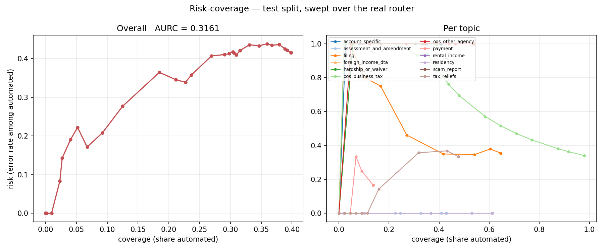
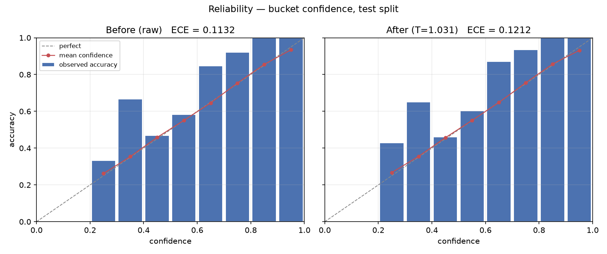

# Evaluation results

This report consolidates the committed evaluation results and explains what each
number means.

## Evaluation scope

- The offline benchmark contains 877 test emails from 36 held-out scenarios and uses seed 42.
- The confidence thresholds were selected on 646 calibration emails without consulting the test split.
- The historical pre-tuning drafting evaluation sampled 50 of the 102 emails selected for automation.
- The human evaluation covers all 24 drafts that were successfully produced.
- Higher values are better for accuracy, precision, recall, F1, coverage, availability, and agreement.
- Lower values are better for risk, expected calibration error, latency, and area under the risk-coverage curve.

## Headline results

| Result | Value | Meaning |
|---|---:|---|
| Intent macro-F1 | **85.9%** (95% interval 76.9%–92.3%) | The classifier performs consistently across the 10 intents instead of being rewarded for common classes. |
| Routing-bucket macro-F1 | **91.7%** (86.2%–97.1%) | The operational routing categories are easier to predict than the detailed intents. |
| Routing-bucket accuracy | **92.8%** (87.4%–97.6%) | About 93 of every 100 test emails entered the correct routing bucket. |
| Must-escalate recall | **100.0%** (456/456) | Every test email marked as requiring an officer was kept out of automation. |
| Automation coverage | **11.6%** (102/877) | The frozen policy automated about one in nine test emails. |
| Automation risk | **1.0%** (1/102) | One automated action used the wrong route or intent under the evaluation definition. |
| PII scrub recall | **100.0%** (99/99) | Every planted identifier was absent after local scrubbing. |
| Historical live drafting availability (pre-tuning) | **48.0%** (24/50) | The retained run used the earlier request configuration; its successful drafts are the human-review sample. |
| Human draft groundedness | **100.0%** (24/24) | The reviewer found every successful draft supported by the supplied SOP evidence. |
| Human tone pass rate | **75.0%** (18/24) | Six drafts needed tone improvement even though their content remained grounded. |
| Human overall acceptability | **95.8%** (23/24) | One draft needed a substantive correction before an officer could send it. |
| Judge-human agreement | **91.7%** (22/24) | The LLM judge agreed with the human groundedness label on 22 drafts. |

- The routing policy is conservative because it achieved perfect must-escalate recall by escalating 319 otherwise automatable cases.
- The main content-quality weakness is redirect tone rather than factual grounding or procedural correctness.
- The historical run's main operational weakness was external drafting availability rather than the local classifier.

## Intent classification

- Accuracy is the share of emails assigned the correct intent.
- Precision is the share of predictions for an intent that were correct.
- Recall is the share of true examples of an intent that were found.
- F1 balances precision and recall.
- Macro-F1 gives every intent equal weight.

| Intent | Precision | Recall | F1 | Test emails |
|---|---:|---:|---:|---:|
| `assessment_and_amendment` | 100.0% | 82.6% | 90.5% | 92 |
| `filing` | 59.5% | 85.7% | 70.3% | 91 |
| `foreign_income_dta` | 81.6% | 84.5% | 83.0% | 84 |
| `hardship_or_waiver` | 98.8% | 96.3% | 97.5% | 82 |
| `oos_redirect` | 75.7% | 93.3% | 83.6% | 90 |
| `payment` | 84.5% | 69.8% | 76.4% | 86 |
| `rental_income` | 100.0% | 100.0% | 100.0% | 80 |
| `residency` | 79.6% | 75.5% | 77.5% | 98 |
| `scam_report` | 100.0% | 100.0% | 100.0% | 84 |
| `tax_reliefs` | 96.9% | 68.9% | 80.5% | 90 |

- Filing has the weakest precision because several assessment, residency, and tax-relief emails were predicted as filing.
- Payment and tax-relief recall are weaker because their questions overlap with filing, foreign-income, and redirect language.
- Perfect rental-income and scam-report scores apply only to the synthetic test scenarios.

## Routing-bucket classification

| Bucket | Precision | Recall | F1 | Test emails |
|---|---:|---:|---:|---:|
| `auto_answerable` | 95.6% | 91.0% | 93.3% | 457 |
| `high_consequence` | 99.4% | 98.2% | 98.8% | 166 |
| `out_of_scope` | 75.7% | 93.3% | 83.6% | 90 |
| `no_supporting_sop` | 90.4% | 92.1% | 91.2% | 164 |
| `requires_account_lookup` | — | — | — | 0 |

- Routing buckets combine intents with the action the system may safely take.
- The account-lookup bucket has no standalone test support because account specificity is evaluated as a cross-topic flag.
- The bucket results matter operationally because a fine-grained intent error can still lead to the correct safe action.

## Escalation safety and selective automation

- Coverage is the share of all test emails handled automatically.
- Risk is the share of automated actions that were incorrect.
- A false escalation reduces coverage but remains recoverable by an officer.
- A false automation is more serious because it exposes the citizen to the wrong action.

| Route | Coverage | Automated | Risk | Wrong |
|---|---:|---:|---:|---:|
| All automated actions | 11.6% (6.2%–17.4%) | 102/877 | 1.0% (0.0%–3.7%) | 1 |
| Auto-reply | 6.3% (2.1%–11.1%) | 55/877 | 0.0% | 0 |
| Redirect | 5.4% (2.2%–8.2%) | 47/877 | 2.1% (0.0%–8.8%) | 1 |

- The area under the risk-coverage curve is 0.0513, where a smaller value means risk stays lower as automation expands.
- The zero observed auto-reply risk does not prove zero deployment risk because the interval is degenerate on this finite synthetic sample.
- The one error occurred on the redirect route, while all 55 auto-replies were correct under the routing definition.

### Coverage by true intent at the frozen thresholds

| Intent | Automated | Coverage | Risk |
|---|---:|---:|---:|
| `assessment_and_amendment` | 14/92 | 15.2% | 0.0% |
| `filing` | 7/91 | 7.7% | 14.3% |
| `foreign_income_dta` | 0/84 | 0.0% | — |
| `hardship_or_waiver` | 0/82 | 0.0% | — |
| `oos_redirect` | 46/90 | 51.1% | 0.0% |
| `payment` | 4/86 | 4.7% | 0.0% |
| `rental_income` | 0/80 | 0.0% | — |
| `residency` | 0/98 | 0.0% | — |
| `scam_report` | 0/84 | 0.0% | — |
| `tax_reliefs` | 31/90 | 34.4% | 0.0% |

- Zero coverage is intentional for high-consequence or unsupported topics.
- Filing contains the only wrong automated action, but its denominator is only seven.

### Escalation reasons

| Reason | Precision | Recall | Reference cases | Meaning |
|---|---:|---:|---:|---|
| Account-specific signal | 77.1% | 84.4% | 64 | The reason catches most private-record requests but also sends some general questions to officers. |
| Computation requested | 67.5% | 90.3% | 62 | The reason prioritizes catching calculation requests at the cost of extra escalations. |
| High consequence | 99.4% | 98.2% | 166 | The reason is both precise and sensitive for hardship and scam cases. |
| No supporting SOP | 90.4% | 92.1% | 164 | The reason usually identifies topics for which runtime knowledge is deliberately unavailable. |
| Foreign-income signal | — | — | 0 | No test item uses this as its reference escalation reason, so a standalone score is not estimable. |

## Rule-based safety flags

- Flag metrics evaluate each detector independently, while escalation-reason metrics evaluate the final reason attached to the route.

| Flag | Precision | Recall | F1 | Positive cases | Meaning |
|---|---:|---:|---:|---:|---|
| Computation requested | 69.8% | 89.8% | 78.6% | 98 | The detector catches most calculation requests but creates 38 false positives. |
| Account-specific signal | 49.5% | 84.4% | 62.4% | 64 | The detector is deliberately broad and is a major source of recoverable over-escalation. |
| Foreign-income signal | 100.0% | 83.3% | 90.9% | 84 | Every detected signal was correct, but 14 true cases lacked the lexical cue. |
| Scam signal | 100.0% | 95.2% | 97.6% | 84 | Every detected signal was correct, but four scam reports lacked the expected wording. |

## PII scrubbing

| Planted type | Detected | Recall |
|---|---:|---:|
| NRIC-shaped identifier | 53/53 | 100.0% |
| Address | 23/23 | 100.0% |
| Postcode | 23/23 | 100.0% |
| Overall | 99/99 | **100.0%** |

- Recall checks whether each planted value is absent from the scrubbed text.
- The result covers the planted formats and does not establish recall for every way a citizen may write personal data.
- Free-text addresses without a street-type token remain a known gap outside the planted sample.

## Calibration

- Expected calibration error measures the average gap between confidence and observed accuracy across confidence bins.
- Temperature scaling changed ECE from 0.1507 to 0.1502, which is an improvement of only 0.0005.
- The fitted temperature is 0.998, so the calibrated probabilities are almost identical to the original probabilities.
- The area under the risk-coverage curve stayed at 0.0513 before and after calibration.
- Calibration is therefore a measured negative result rather than a meaningful performance improvement.

## Ablations

| Change | Result | Meaning |
|---|---:|---|
| Temperature scaling | AURC 0.0513 → 0.0513 | Calibration changed confidence honesty slightly but did not change selective-routing quality. |
| One global threshold | AURC 0.0513 → 0.0584 | A single threshold performs worse than the frozen per-bucket policy. |
| Remove PII scrubbing | Macro-F1 0.8593 → 0.8582 | Keeping PII changed macro-F1 by only −0.0011, so local scrubbing has negligible measured classification cost. |

## Encoder versus zero-shot LLM

| Model | Accuracy | Macro-F1 | ECE | Seconds per email | API calls |
|---|---:|---:|---:|---:|---:|
| Fine-tuned MiniLM | 80.0% | **80.9%** | 0.169 | **0.67** | 0 |
| Qwen zero-shot, three samples | 53.3% | 54.0% | **0.073** | 10.60 | 90 |

- Both models use the same stratified 30-email sample.
- MiniLM is more accurate, about 16 times faster, local, and free of runtime API calls.
- Qwen's lower ECE is not enough to offset its weaker classification and coarse three-value confidence distribution.
- The comparison sample is small, so it supports the deployment choice rather than a universal model ranking.

## Live drafting and machine judging

This 50-item run was generated before the latency fix, with Gemini's provider-default
medium thinking, no output-token cap, one SDK attempt, and a 45-second timeout. It is
retained because the 24 successful outputs are the exact human-reviewed sample. It
must not be read as an availability estimate for the current runtime configuration.

| Outcome | Count | Meaning |
|---|---:|---|
| Draft attempts | 50 | The seeded sample contains 20 auto-replies and 30 redirects. |
| Successful drafts | 24 | These drafts form the quality-evaluation denominator. |
| Timeouts | 12 | The provider did not return within the configured time. |
| Rate limits | 10 | The free-tier quota rejected the request. |
| Other API errors | 4 | The provider failed for another API-level reason. |
| Drafting availability | **48.0%** | Availability measures whether text was produced, not whether the text was correct. |

- Failed drafting calls stay in the officer queue and are not counted as zero-quality drafts.
- SOP selection was correct for all five cases where the system had to choose among multiple SOPs.
- Compound Mini judged all 24 successful drafts and marked 22 grounded and two ungrounded.
- The judge marked 8/10 auto-replies and 14/14 redirects grounded.
- The current minimal-thinking, 768-token, 75-second configuration passed a separate
  one-call operational smoke check in 21.74 seconds with a valid citation. A sample
  of one confirms operation, not availability.

## Human draft evaluation

- One blinded reviewer rated all 24 successful drafts.
- Wilson intervals show uncertainty from the small number of reviewed drafts.
- Inter-human agreement is not available because Reviewer B was excluded from the final analysis.

| Dimension | Passing | Rate | 95% Wilson interval | Meaning |
|---|---:|---:|---:|---|
| Groundedness | 24/24 | **100.0%** | 86.2%–100.0% | Every factual claim was supported by an SOP or attributed to the citizen. |
| Correct next step | 24/24 | **100.0%** | 86.2%–100.0% | Every draft followed the supported operational action. |
| Safety and privacy | 24/24 | **100.0%** | 86.2%–100.0% | No draft invented sensitive information, unsafe instructions, or unsupported promises. |
| Completeness | 24/24 | **100.0%** | 86.2%–100.0% | Every draft covered the material supported steps required by its SOP. |
| Tone | 18/24 | 75.0% | 55.1%–88.0% | Six drafts were grounded but not sufficiently clear, respectful, or reassuring. |
| Overall acceptability | 23/24 | **95.8%** | 79.8%–99.3% | One draft required more than proofreading before it could be sent. |

### Human results by route

| Route | Drafts | Grounded | Next step | Safety | Complete | Tone | Overall |
|---|---:|---:|---:|---:|---:|---:|---:|
| Auto-reply | 10 | 100.0% | 100.0% | 100.0% | 100.0% | 90.0% | 100.0% |
| Redirect | 14 | 100.0% | 100.0% | 100.0% | 100.0% | 64.3% | 92.9% |

- Redirects are procedurally correct but often feel abrupt, especially when a citizen sounds anxious.
- The appropriate fix is approved reassurance or richer redirect guidance in the SOP rather than unsupported advice from the model.
- Tone failures do not automatically imply overall rejection because minor wording can be corrected during proofreading.

### LLM judge against the human reference

| Result | Value | Meaning |
|---|---:|---|
| Comparable drafts | 24 | Every successful draft has both a human and machine groundedness label. |
| Raw agreement | 22/24 (91.7%) | The judge agreed with the reviewer on 22 drafts. |
| Judge ungrounded precision | 0/2 (0.0%) | Both machine ungrounded flags were false alarms against the human reference. |
| Judge ungrounded recall | — | Recall cannot be measured because the reviewer found no ungrounded draft. |
| Cohen's kappa | — | Kappa is undefined because the human used only the grounded class. |

- The judge result supports high agreement on this sample but does not show that the judge can catch a genuinely ungrounded draft.
- The overall-acceptability `PASS` entries were normalized to the equivalent allowed label, `ACCEPT`, during scoring.
- Four negative rows lack review notes, so some item-level rationale is unavailable.

## Uncertainty and limitations

- The 95% offline intervals use 2,000 stratified bootstrap resamples of whole scenarios rather than individual email variants.
- Scenario-level resampling avoids treating near-related variants as independent observations.
- The intervals quantify variation across the 36 observed test scenarios and do not cover synthetic-data bias or deployment shift.
- The balanced synthetic benchmark does not represent the seasonal topic mix of a real government inbox.
- Historical live drafting availability reflects one pre-tuning provider run and may change with configuration, quotas, latency, and model availability.
- Human-quality results use one reviewer, so individual rating bias and inter-human reliability are not measured.
- A result of 100% on 24 drafts still has a lower 95% Wilson bound of 86.2%.

## Reproduction and source artifacts

- Run `python eval/run_eval.py --no-draft` to regenerate the offline metrics without an API key.
- Run `python eval/human_review.py score --ratings eval/human_review/reviewer_a.csv --single-reviewer --normalize-overall-pass --allow-missing-rating-notes` to regenerate the human report.
- Headline metrics and run metadata are stored in [`summary.json`](summary.json).
- Classification results are stored in [`classification.json`](classification.json) and [`classification_buckets.json`](classification_buckets.json).
- Routing results are stored in [`escalation.json`](escalation.json), [`flags.json`](flags.json), and [`risk_coverage.json`](risk_coverage.json).
- Privacy and calibration results are stored in [`scrub_recall.json`](scrub_recall.json), [`calibration.json`](calibration.json), and [`ablations.json`](ablations.json).
- Model-comparison results are stored in [`encoder_vs_llm.json`](encoder_vs_llm.json).
- Drafting and judge results are stored in [`drafting.json`](drafting.json) and [`drafts.json`](drafts.json); the current-runtime operational check is stored in [`drafting_runtime_smoke.json`](drafting_runtime_smoke.json).
- Human results are stored in [`HUMAN_EVAL_REPORT.md`](HUMAN_EVAL_REPORT.md) and [`judge_human_agreement.json`](judge_human_agreement.json).
- Bootstrap intervals are stored in [`uncertainty.json`](uncertainty.json).
